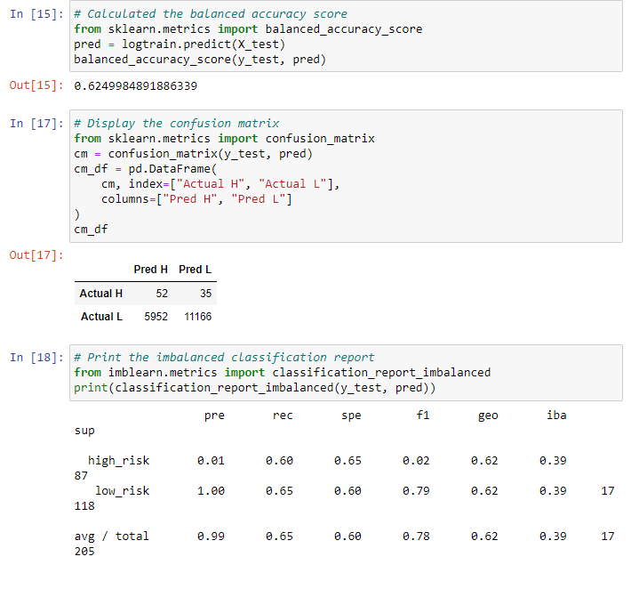
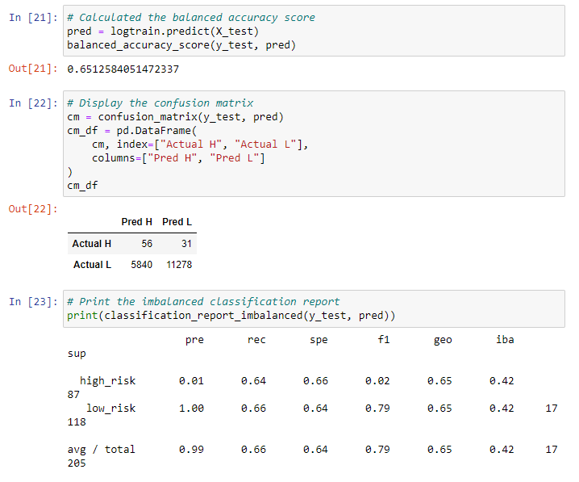
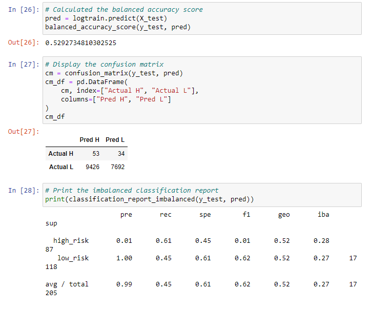
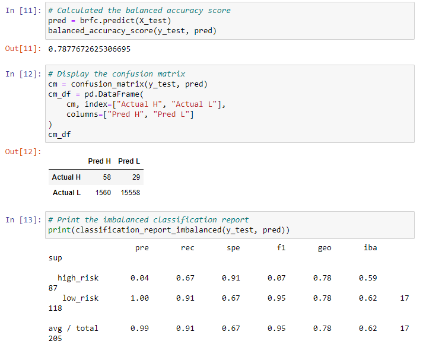

# Credit Risk Analysis
Throughout this module, we have used credit application risk to help visualize how machine learning can help determine whether someone is high or low risk, and how that can influence approval. In this challenge, I use Machine Learning skills to analyze credit application risk and actually search for the most effective machine learning model for this specific task. I use random oversampling, SMOTE, undersampling, SMOTEENN, random forest, and adaboost models to determine the best for the data, and with the results gathered, there is, in fact, a best.

## Results
- Naive Random Oversampling:
  - Balanced Accuracy Test = 62.50%
  - High-risk precision is 1% and recall is 60%
  - Low-risk precision is 100% and recall is 65%
  - Notes: This model did not perform the best, and the low risk precision performs at this rate across all models, likely due to the very large amount of low-risk applications. High-risk precision performs similarly due to the very small amount of applications.
 

- SMOTE:
  - Balanced Accuracy Test = 65.13%
  - High-risk precision is 1% and recall is 64%
  - Low-risk precision is 100% and recall is 66%
  - Notes: This model performed slightly better than random sampling. We'll see later that it was also not our best performer.

- Undersampling by ClusterCentroids:
  - Balanced Accuracy Test = 52.93%
  - High-risk precision is 1% and recall is 61%
  - Low-risk precision is 100% and recall is 45%
  - Notes: This model had the worst accuracy score, and had a severe decrease in the Low-risk recall score. I would not recommend this model for this task.

- SMOTEENN:
  - Balanced Accuracy Test = 61.64%
  - High-risk precision is 1% and recall is 69%
  - Low-risk precision is 100% and recall is 54%
  - Notes: This model saw our highest high-risk recall score this far, which would be exactly what we would want if we are trying to find high-risk applicants repeatedly.

- Balanced Random Forest Classifier:
  - Balanced Accuracy Test = 78.78%
  - High-risk precision is 4% and recall is 67%
  - Low-risk precision is 100% and recall is 91%
  - Notes: This model saw a significant accuracy score increase from the other models. Low-risk score also improved to 91%.

- Easy Ensemble Classifier AdaBoost:
  - Balanced Accuracy Test = 92.54%
  - High-risk precision is 7% and recall is 91%
  - Low-risk precision is 100% and recall is 94%
  - Notes: This model by far performed the best of all models. It had the highest accuracy, high-risk recall, and low-risk recall.

## Summary
Out of all the models created and tested, the Ensemble models performed the strongest, having stronger accuracy scores as well better recall and precision scores. However, I would specifically look at the Easy Ensemble AdaBoost model for this task. Not only did it yield the best accuracy, but also beat out the Random Forest model for the highest Low-risk applicant recall score, meaning it would catch almost all low-risk applicants in the process. Most importantly, this model has the highest precision and recall scores for the high-risk applicants. However, for this application, we would ideally want a high precision score for our high-risk group, and ours is only 7%. That means that this model would correctly catch most high-risk applicants, but it would also flag low-risk applicants, which would not be a wise business move. For this specific task, Easy Ensemble performed the best, but I would not recommend any of the models tested.
